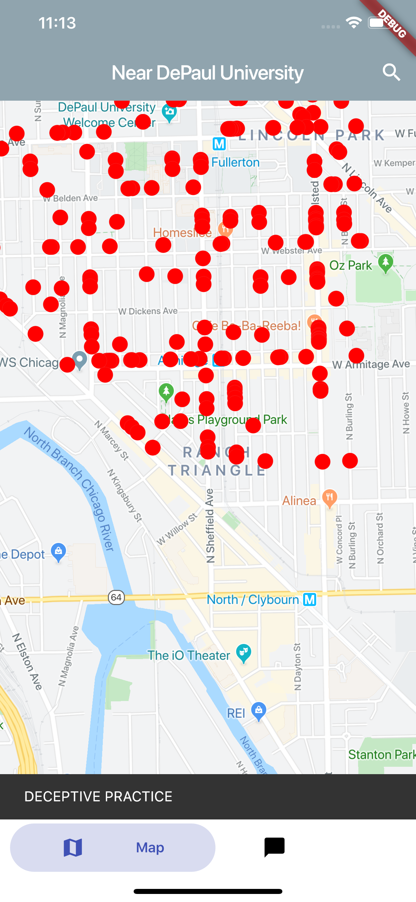

# Safe Map
Helping people navigate their cities safer!

## Inspiration
How can we make navigating the city of Chicago safer?

~20% of students walk to school every morning
Total Violent Crimes in Chicago: 904
Sun-Times counted 241 homicides this year
Chicago Tribune reported that CPD solved one in every 20 shootings

## What it does
Give people the tools to make data-driven decisions!
Highlight routes/areas in a commute that may be dangerous
Pull info from social media about crimes that are happening in real-time
People can post in real-time about the crimes in the city

